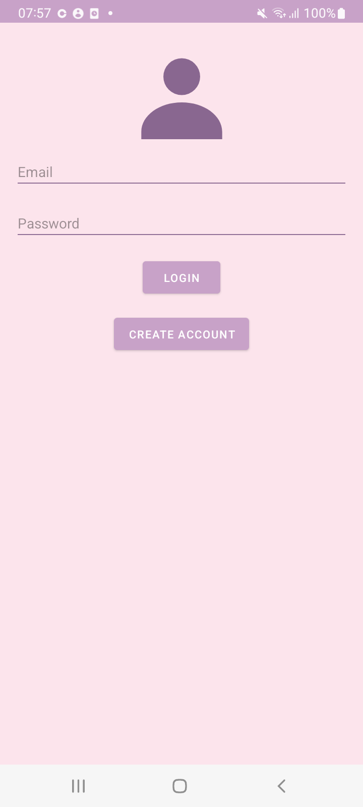
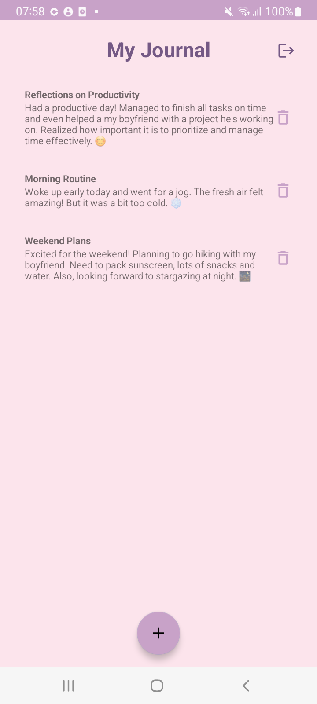
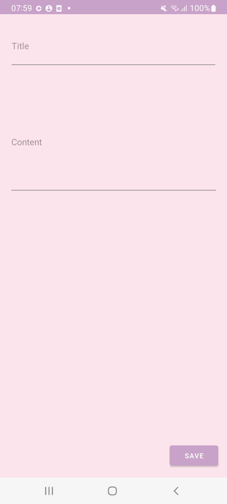

# JournalApp 📓


**JournalApp** is a modern and user-friendly journaling application for Android. It allows users to log in, create, edit, and delete personal journal entries. Each user's data is securely stored and isolated using Firebase Authentication and Firestore.

## Features 🚀

- **User Authentication**: Login and registration powered by Firebase Authentication.
- **Create and Edit Entries**: Add new journal entries or update existing ones.
- **Delete Entries**: Delete entries with a single tap.
- **Real-time Data Sync**: Firebase Firestore ensures instant updates for the user’s data.
- **User-specific Data**: Each user’s journal entries are private and stored separately.
- **Modern UI**: A clean and pastel aesthetic with smooth transitions.

## Screenshots 📸

| Login Screen                     | Main Screen                      | Add Entry Screen                   |
|----------------------------------|----------------------------------|------------------------------------|
|        |          |  |


## Download 📥

Grab the latest signed APK from the [**Releases**](../../releases) page and install it on any Android device (Android 7.0 or newer).


## Getting Started 🛠️

### Prerequisites

- Android Studio installed on your system.
- A Firebase project with Authentication and Firestore set up.

### Installation

1. Clone this repository:
   ```bash
   git clone https://github.com/youthinkyoucancode/JournalApp.git
   ```
2. Open the project in Android Studio.
3. Connect your Firebase project:
    - Add the `google-services.json` file to the `app/` directory.
    - Enable **Authentication** and **Firestore** in your Firebase Console.
4. Build and run the app on your emulator or physical device.

### Firebase Setup

- Ensure **Email/Password Authentication** is enabled in your Firebase Console.
- Create a Firestore database. "Test mode" is fine for local development — but before sharing the app, switch to production rules that restrict each entry to its owner's `userId`.

### Running the App

1. Sync the Gradle files in Android Studio.
2. Build and run the app on your preferred device or emulator.
3. Register or log in using your credentials.
4. Start journaling!

## Technologies Used 🛠️

- **Kotlin**: Programming language.
- **Firebase Authentication**: User management.
- **Firestore Database**: Cloud-based storage for journal entries.
- **Material Design**: UI components.

## Contributing 🤝

Contributions are welcome! Please fork this repository and submit a pull request for any changes or improvements.

## License 📄

This project is licensed under the [MIT License](LICENSE).

---

### Made by Abir
